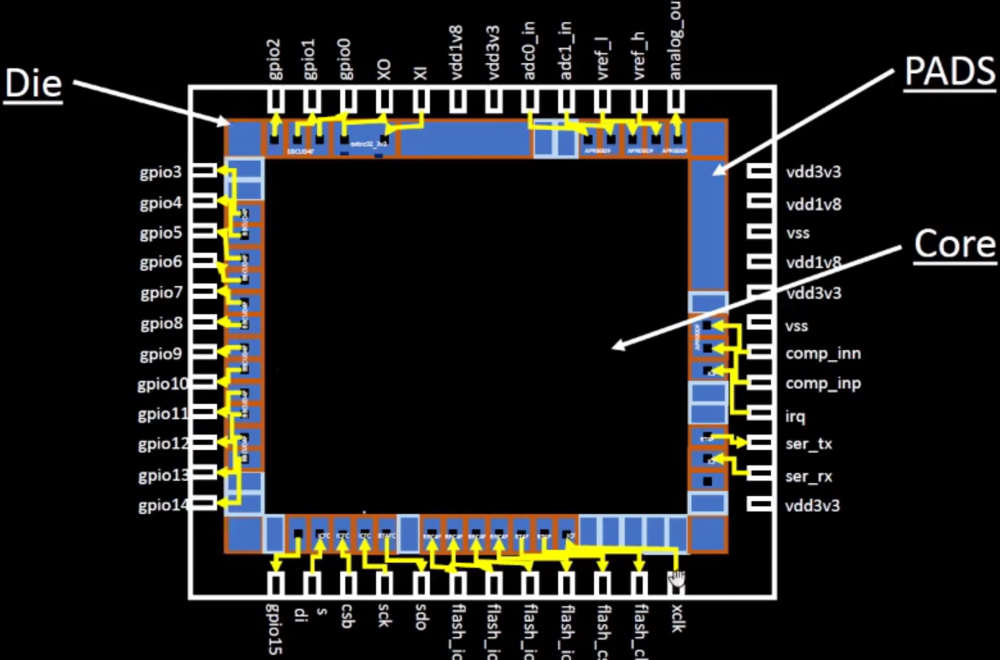
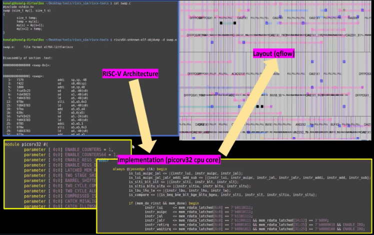
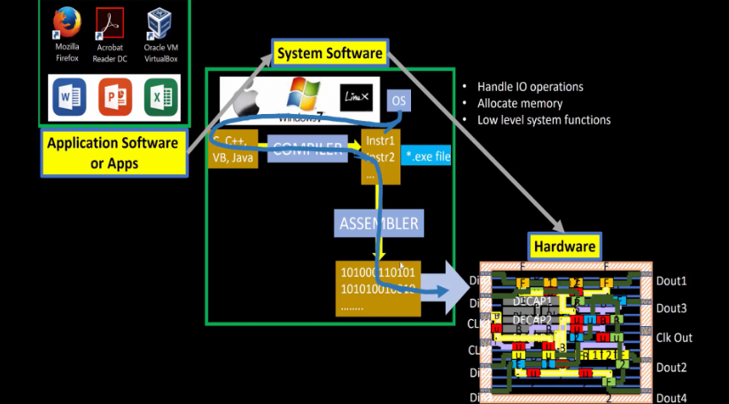
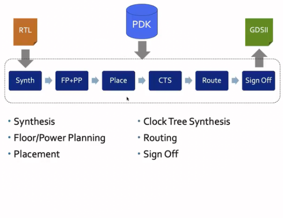
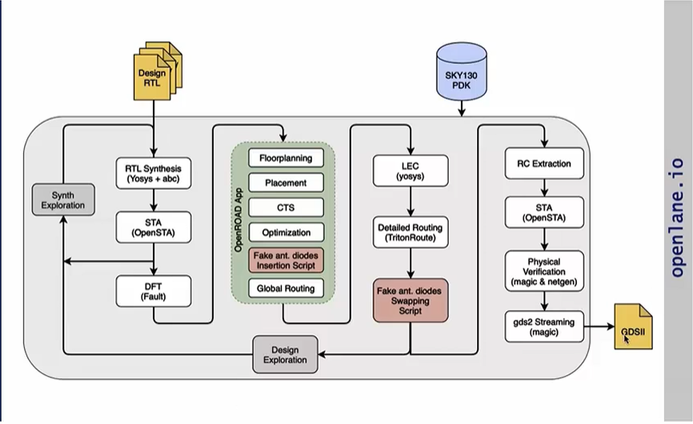
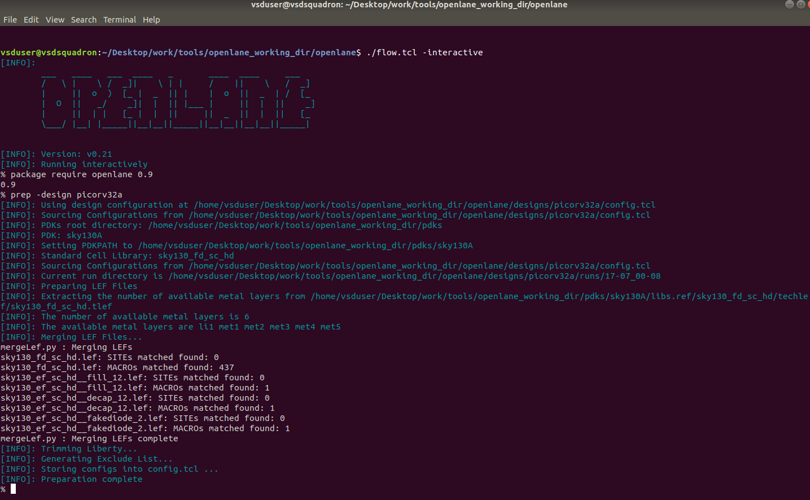
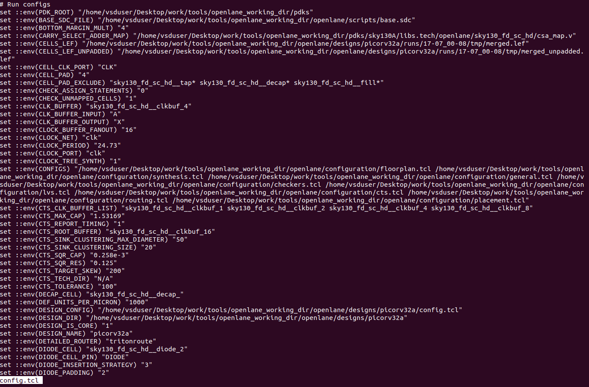
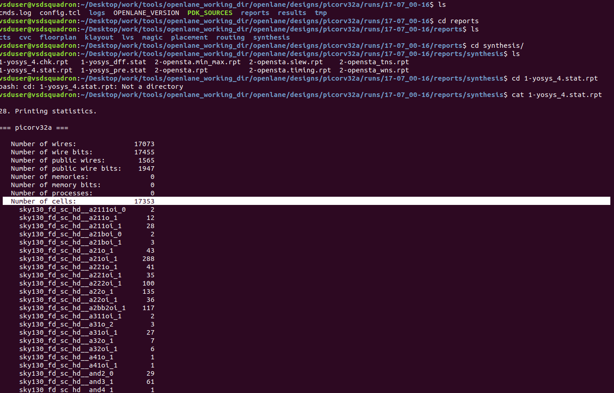
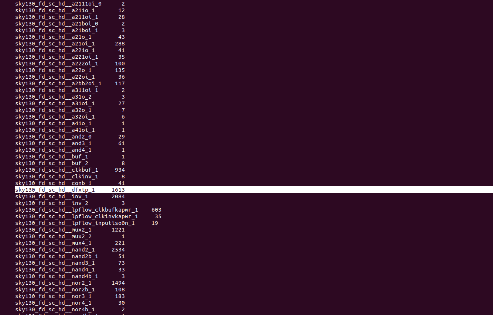

# vsdiat-soc-design-and-planning
Walk through of a VLSI SoC design and planning workshop organized by VSD


## Core Concepts

### Chip Components
* **PADS**: Facilitate communication between the inside of the chip core and the outside world by sending signals through them.
* **Foundry IPs (Intellectual Property)**: Pre-designed blocks that require a certain level of intelligence or expertise to build from scratch.
* **Macros**: Components built from pure digital logic.



### RISC-V
* A **free and extensible blueprint** that anyone can use to design processors.
* It's an **Instruction Set Architecture (ISA)**, which defines how software communicates with hardware.
* The ISA's role is to parse information from a high-level programming language (like C) into a machine language program (binary).



### Software to Hardware Flow
The process follows this general path:
**Application Software** → **System Software** (OS → Compiler → Assembler) → **Binary** → **Hardware**



---

## SoC Design with OpenLane

### Key Components of Digital ASIC Design
* **RTL IP’s**: The design files, often found on platforms like GitHub.
* **EDA Tools**: Electronic Design Automation tools like **OpenROAD** and **OpenLANE**.
* **PDK Data**: The Process Design Kit data, such as the **Skywater PDK**.
    > The **PDK (Process Design Kit)** serves as the critical interface between the fabrication plant (FAB) and chip designers.

### The ASIC Design Flow
1.  **Synthesis (Synth)**
    * Converts Register-Transfer Level (**RTL**) code into a circuit (**netlist**) made of components from a **Standard Cell Library**.
    * Standard cells are pre-designed logic gates with regular layouts and multiple views/models for different tools.

2.  **Floor Planning (FP) & Power Planning (PP)**
    * **Chip Floor-Planning**: Partitions the chip area between different building blocks and places the I/O pads.
    * **Macro Floor-Planning**: Defines the dimensions and pin locations for macros.
    * **Power Planning**: Creates the power grid using power pads (**VDD/VSS**), rings, and straps.

3.  **Placement (Place)**
    * Places the standard cells from the netlist onto the rows defined in the floorplan.
    * This is typically done in two stages: **Global Placement** and **Detailed Placement**.

4.  **Clock Tree Synthesis (CTS)**
    * Builds the clock distribution network to deliver the clock signal efficiently to all sequential elements (like flip-flops) across the chip.

5.  **Routing (Route)**
    * Implements the physical wiring (interconnects) between all the cells using the available metal layers.
    * In the Skywater 130nm PDK, there are 6 metal layers: the lowest is for local interconnects (titanium nitride) and the other five are aluminum.
    * The process defines vias to connect different layers, forming a huge routing grid.
    * Done in two stages: **Global Routing** (creates quick routing guides) and **Detailed Routing** (implements the actual wires).

6.  **Sign Off → GDSII**
    * This is the final verification stage before the design is sent for manufacturing. The final layout file format is **GDSII**.
    * **Physical Verification**:
        * **Design Rules Checking (DRC)**: Ensures the layout doesn't violate any manufacturing rules.
        * **Layout vs. Schematics (LVS)**: Confirms the manufactured layout matches the original circuit diagram (schematic).
    * **Timing Verification**:
        * **Static Timing Analysis (STA)**: Checks that the chip meets its performance and speed requirements.



---

## OpenLANE Tool Overview

**OpenLANE** is an open-source automated flow for generating a final chip layout (GDSII) from RTL code, with a goal of producing a clean design with no human intervention.

* **SoC Family**: StriVe
* **Technology**: Tuned for the **SkyWater 130nm Open PDK**.
* **Modes of Operation**: Can be run in **Autonomous** or **Interactive** mode.

### OpenLANE Flow Stages
1.  **Synthesis Exploration**: Generates reports showing the delay and area for different synthesis strategies.
2.  **Design Exploration**: Shows performance metrics for different configurations and includes regression testing.
3.  **Design For Test (DFT)**: Inserts logic to make the chip testable after manufacturing. Includes scan chain insertion, Automatic Test Pattern Generation (ATPG), and fault simulation.
4.  **Physical Implementation (PnR)**: The automated Place and Route process, handled by **OpenROAD**.




### Important Concepts in Physical Implementation
* **Logic Equivalence Check (LEC)**: Verifies that the circuit's function has not changed after the netlist is modified (e.g., during optimization or CTS).
* **Antenna Diodes**: During fabrication, long metal wires can act as antennas, collecting charge that can damage sensitive gate oxides. Antenna diodes are inserted to safely dissipate this charge.

---

## Getting Started with OpenLANE with picorv32a

**Documentation:** [openlane.readthedocs.io](https://openlane.readthedocs.io/en/latest/usage/index.html)



* **Set Up Interactive Mode:**
    ```bash
    ./flow.tcl -interactive
    ```
* **Load Package:**
    ```tcl
    package require openlane 0.9
    ```
* **Run a Design:**
    ```tcl
    prep -design <design_name>
    ```
* **Run Synthesis:**
    ```tcl
    run_synthesis
    ```

### Now I go check the picorv32a config file



### Then to calculate the flop ratio using the synthesis reports




We calculate the Flop Ratio and DFF % from the synthesis report file

Flop Ratio = 1613/17353 = 0.09295222728

DFF % = 0.09295222728 * 100 = 9.295222728 %

