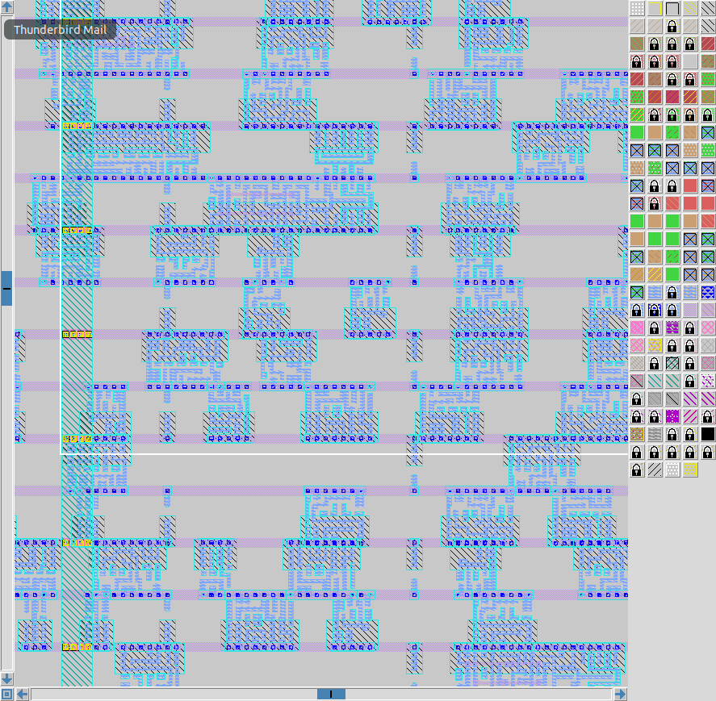

## Core Concepts

### Core and Die Size
* **Core**: Part made from standard cells and logic
* **Die**: Area surrounding the Core
* **Utilization Factor**: Area occupied by the Netlist / The total area of the core --> Ideally go for 50-60% to leave some room for extra logic
* **Aspect Ratio**: The rectangular shape of the chip; Height/Width


### Preplaced Cells
* Standard cells can be broken up and turned into black boxes that once placed can be reused by the automated placement

### Decoupling Capacitors
* When blocks are being placed, decoupling capacitors are placed around them to stabilize the current draw from the switching of the CMOS gates

### Power planning
* The input and output pins are on different sides
* To mitigate "ground bounces" power is evenly distributed throughout the chip
* To maintain the signals, repeaters / buffers are placed along the chip
* The clock ports are larger than data ports because they drive the chip and need less resistance


## Floorplanning

## After running synthesis we can use the following command to create a floorplan of picorv32a

* 
    ```tcl
    run_floorplan
    ```


## We can then check the info on our floorplan run inside the config file


## After navigating to the run file of the floorplan we can use this command to open magic inside this file

  * 
    ```tcl
    magic -T /home/vsduser/Desktop/work/tools/openlane_working_dir/pdks/sky130A/libs.tech/magic/sky130A.tech lef read ../../tmp/merged.lef def read picorv32a.floorplan.def &
    ```


## Using s to select the floorplan, v to center ourselves, and then z and Shift+z to zoom in and out; We can zoom in on the individual cells


## Then navigating to the bottom left corner we can find our preplaced cells


## After checking out our floorplan we can move back to our openlane and run the placement
  * 
    ```tcl
    run_placement
    ```
  


## Like before, we move to our run file and open magic with a similar command

  * 
    ```tcl
    magic -T /home/vsduser/Desktop/work/tools/openlane_working_dir/pdks/sky130A/libs.tech/magic/sky130A.tech lef read ../../tmp/merged.lef def read picorv32a.placement.def &
    ```


## Magic should open and we can see that our preplaced cells that used to be in the bottom corner have now been distributed


## And here is a close up


## With x and Shift+x we can expand the cells and see their contents



