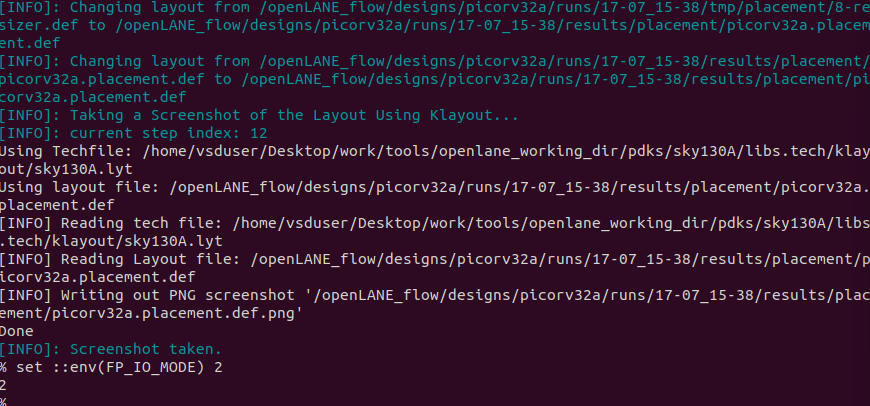

## Core Concepts

## Changing Characterization

## Lets try changing the characterization of our IO ports by modifying the spacing during the floorplan

## As we can see in running magic of our current floorplan, the IO ports are evenly spaced

## We can see which variable changes this in our main configuration file and then we can see our current setting from the floorplan config

## We can copy the setting into our running openlane design and then run floorplan again to set it. Doing it in the running design means the change only affects this instance and not the design as a whole.

## Now when we run magic just like we did before the IO ports are touching eachother

