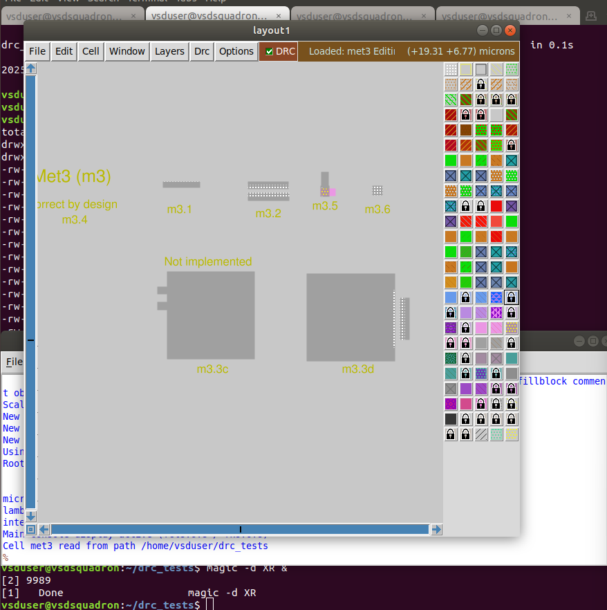
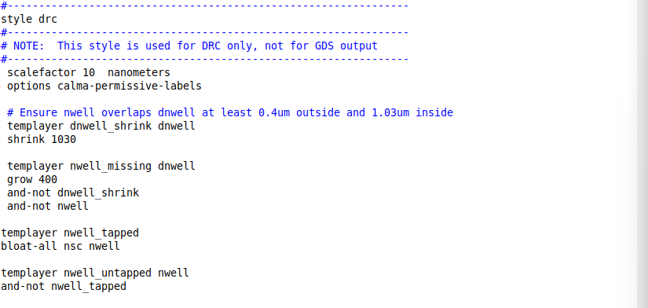

## Changing Characterization

### Lets try changing the characterization of our IO ports by modifying the spacing during the floorplan

### As we can see in running magic of our current floorplan, the IO ports are evenly spaced


### We can see which variable changes this in our main configuration file and then we can see our current setting from the floorplan config


### We can copy the setting into our running openlane design and then run floorplan again to set it
### Doing it in the running design means the change only affects this instance and not the design as a whole


### Now when we run magic just like we did before the IO ports are touching eachother


## Examining an Inverter and extracting spice netlist

### First clone the git repository

```
git clone https://github.com/nickson-jose/vsdstdcelldesign.git
```


### Copy our tech file into the new repository folder and then run magic


### We can select with s and type what in the terminal to see what something is


### Then run the following commands to extract


### Now use Vim to open the new .spice file and make the changes


*Also change the scale at the top from 10m to 10000u

### Run ngspice and check the graph to see the inverter is working


## DRC tests

### Begin by installing some corrupted skywater process magic tech files to perform drc corrections

```
# Change to home directory
cd

# Command to download the lab files
wget http://opencircuitdesign.com/open_pdks/archive/drc_tests.tgz

# Since lab file is compressed command to extract it
tar xfz drc_tests.tgz

# Change directory into the lab folder
cd drc_tests

# List all files and directories present in the current directory
ls -al

# Command to view .magicrc file
gvim .magicrc

# Command to open magic tool in better graphics
magic -d XR &
```


### We will make a simple DRC implementation in the metal 3 file



### Here is the rule we need to implement
More can be found at: https://skywater-pdk.readthedocs.io/en/main/rules/periphery.html


### Now make some changes in the skywater130A.tech file in the same folder


### The next and final fix is more complicated but is made in the same way. This time in the nwell rules




Now when running drc check there is no issue with the nwell