## Converting Grid info to Track info

### Find the tracks.info of sky130_fd_sc_hd and check your track dimensions

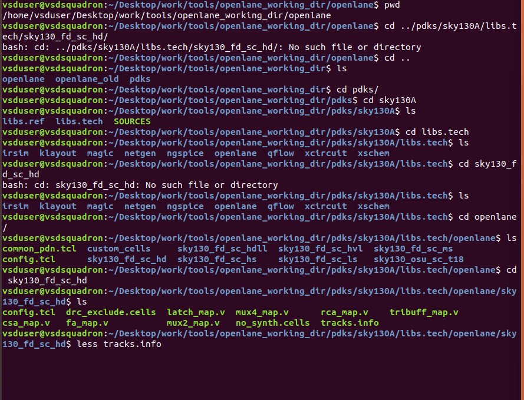


### Now inside the inverter file from before you can press G to show the grid and a small black dot should appear in the bottom left of the design

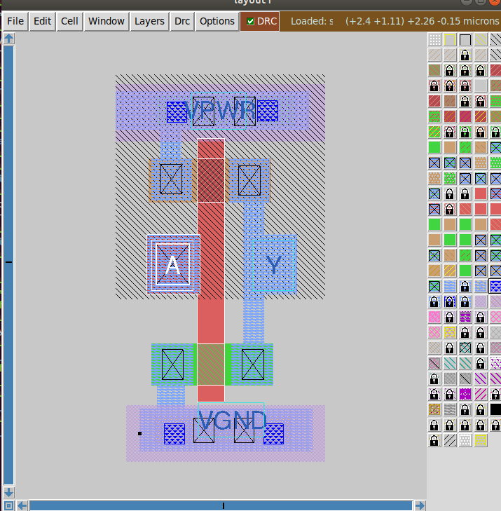

### To align our grid to the correct size to match the track dimensions from earlier type this in the tkcon

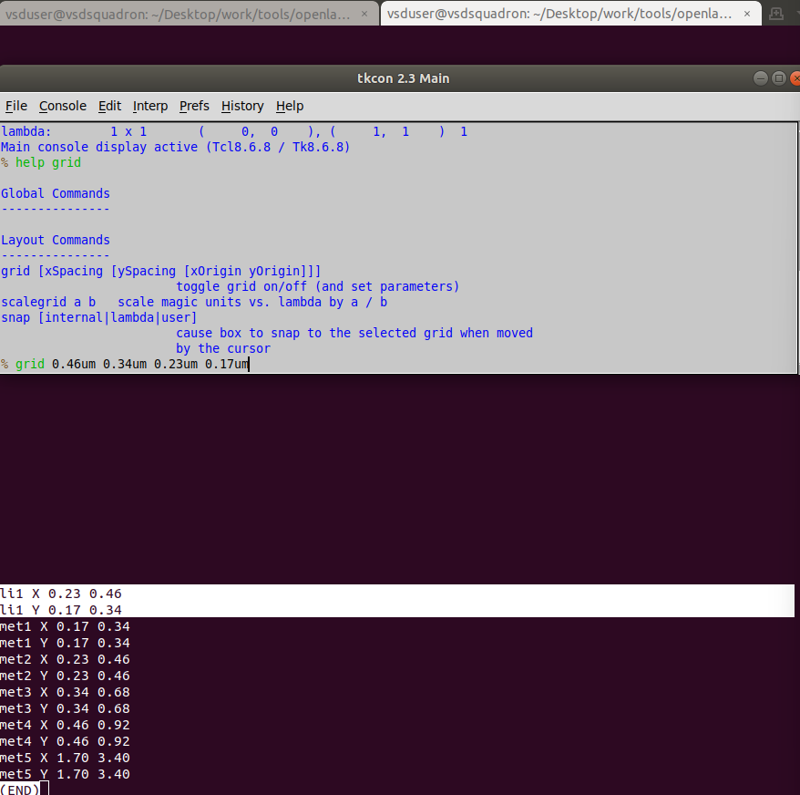

### Now the grid is the correct size and the inverter is 3 squares wide, verifying the conditions for the track (We assigned .46 to be the width of a grid cell and the width of the standard cell if you select it is 1.38 or three times that number)

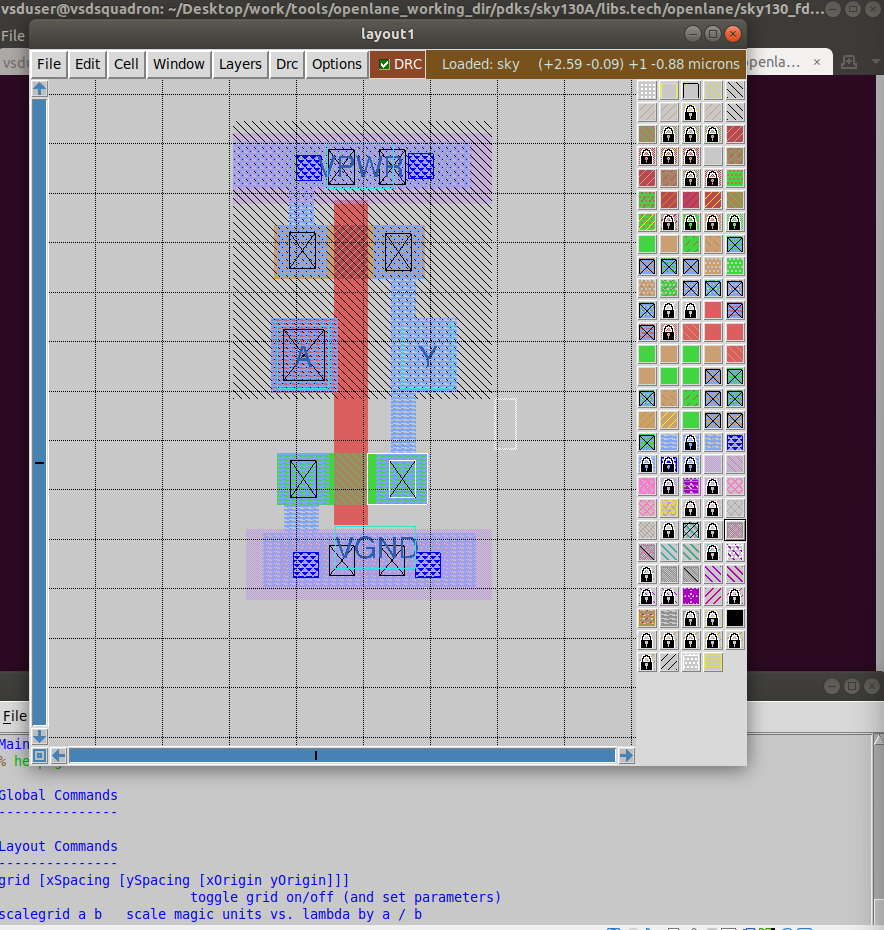

### To practice creating a port with a label, select the A port, open this window and type in the following

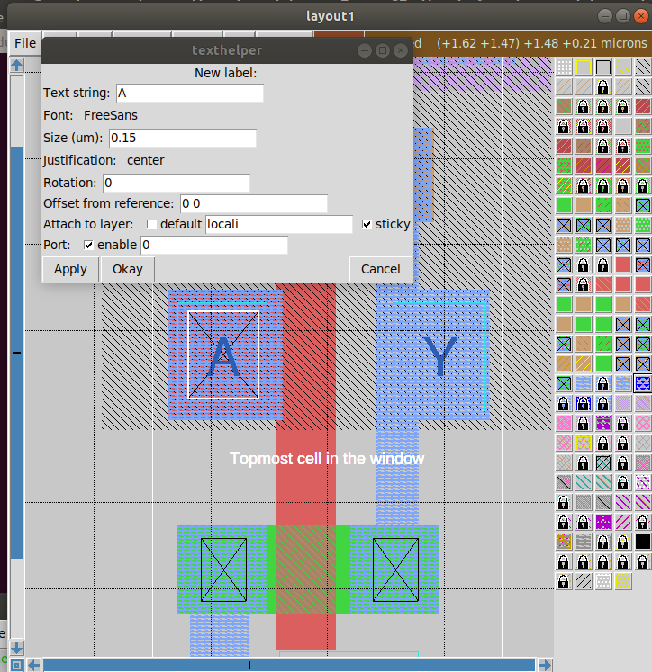

### You can also select the Y port and type in these commands to assign the port a class and use

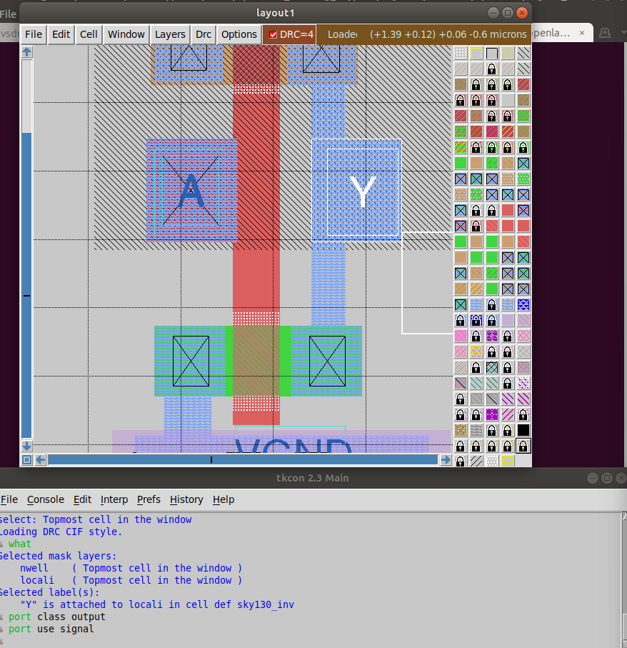

### Now save this to a .lef file

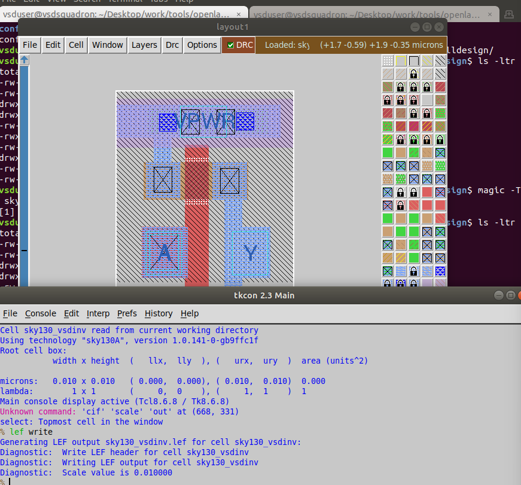

### You can see the port information is in the .lef file

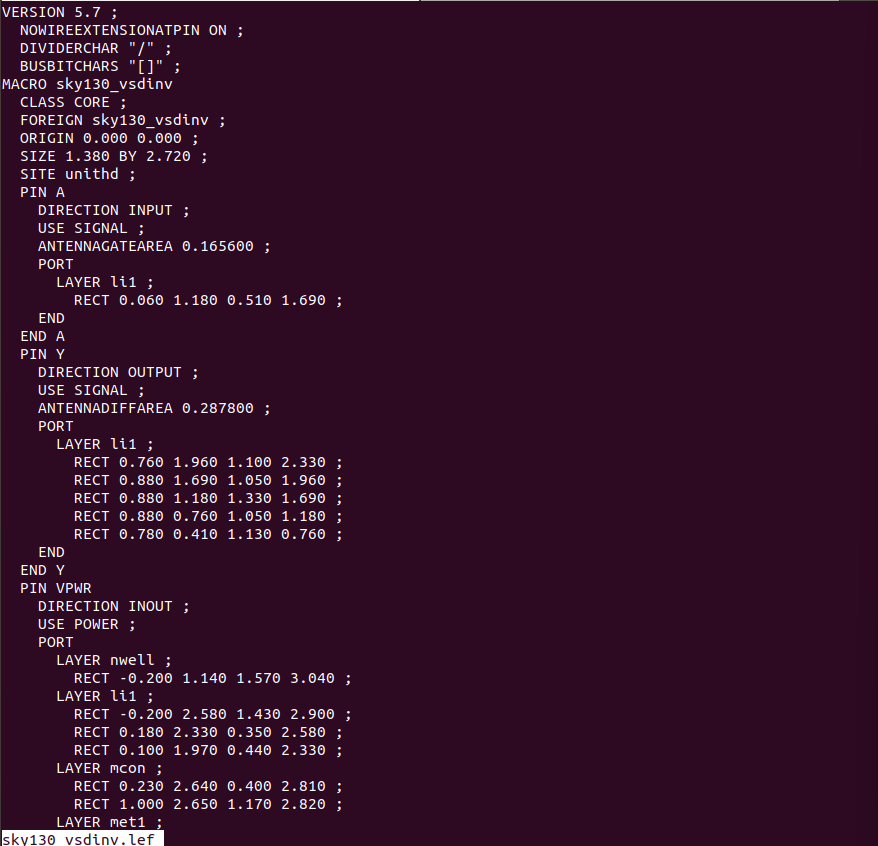

### Now we copy the .lef file to src

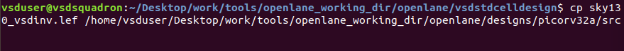

### Then inside the libs folder in the vsdstdcelldesigns also copy the lib files

```
# Copy lef file
cp sky130_vsdinv.lef ~/Desktop/work/tools/openlane_working_dir/openlane/designs/picorv32a/src/

# List and check whether it's copied
ls ~/Desktop/work/tools/openlane_working_dir/openlane/designs/picorv32a/src/

# Copy lib files
cp libs/sky130_fd_sc_hd__* ~/Desktop/work/tools/openlane_working_dir/openlane/designs/picorv32a/src/

# List and check whether it's copied
ls ~/Desktop/work/tools/openlane_working_dir/openlane/designs/picorv32a/src/
```


### Next we need to edit config.tcl

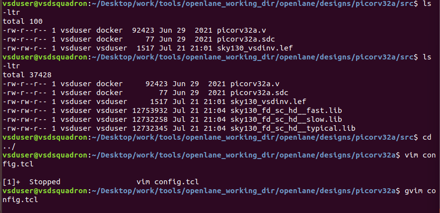

### Paste in these lines

```
set ::env(LIB_SYNTH) "$::env(OPENLANE_ROOT)/designs/picorv32a/src/sky130_fd_sc_hd__typical.lib"
set ::env(LIB_FASTEST) "$::env(OPENLANE_ROOT)/designs/picorv32a/src/sky130_fd_sc_hd__fast.lib"
set ::env(LIB_SLOWEST) "$::env(OPENLANE_ROOT)/designs/picorv32a/src/sky130_fd_sc_hd__slow.lib"
set ::env(LIB_TYPICAL) "$::env(OPENLANE_ROOT)/designs/picorv32a/src/sky130_fd_sc_hd__typical.lib"

set ::env(EXTRA_LEFS) [glob $::env(OPENLANE_ROOT)/designs/$::env(DESIGN_NAME)/src/*.lef]
```

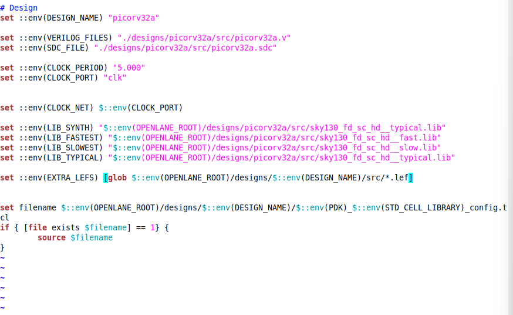

### Now we need to run openlane to see our new inverter in the picorv32a

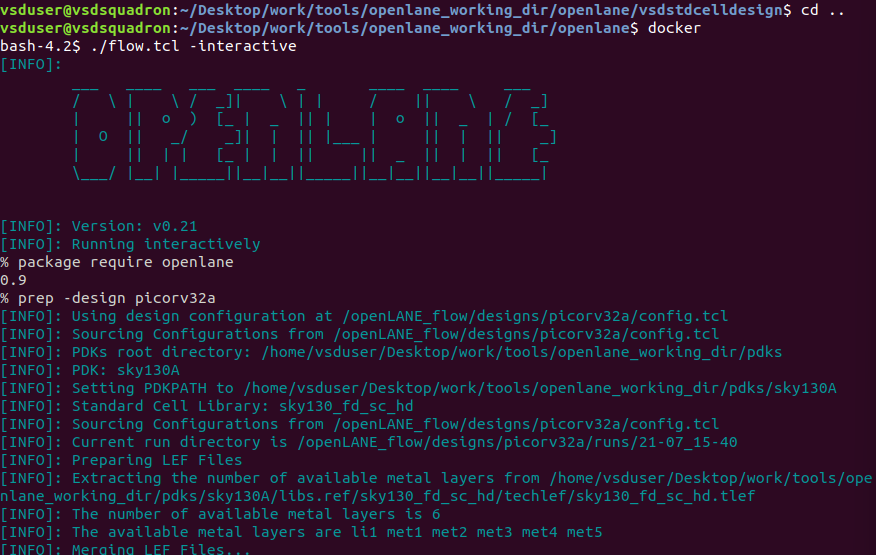

### paste in a few lines after prepping to run picorv32a with the inverter and then run synthesis

```
# Adiitional commands to include newly added lef to openlane flow
set lefs [glob $::env(DESIGN_DIR)/src/*.lef]
add_lefs -src $lefs
```

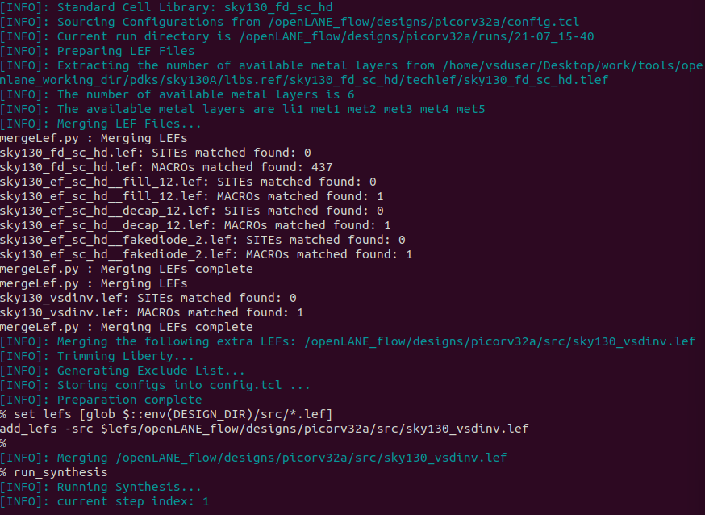

### After running the synthesis we see that there is an issue with the slack and take note of these numbers and the size

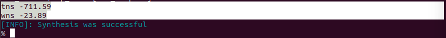
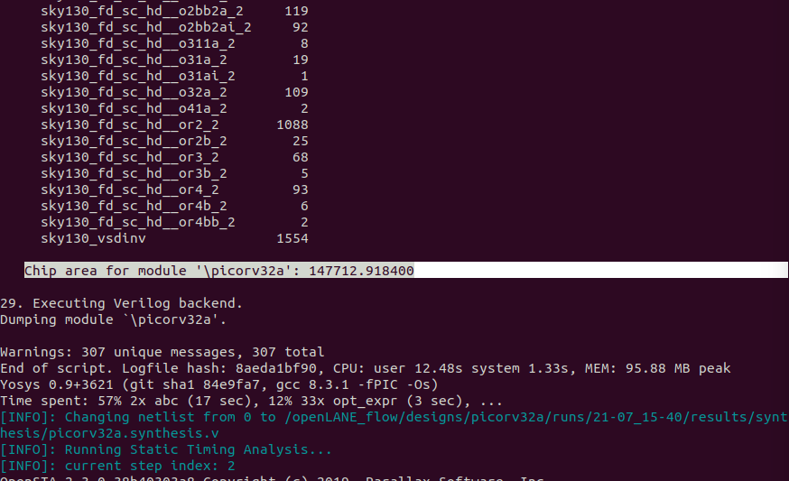

### Now run these commands to view and edit the synthesis settings

```
# Command to display current value of variable SYNTH_STRATEGY
echo $::env(SYNTH_STRATEGY)

# Command to set new value for SYNTH_STRATEGY
set ::env(SYNTH_STRATEGY) "DELAY 3"

# Command to display current value of variable SYNTH_BUFFERING to check whether it's enabled
echo $::env(SYNTH_BUFFERING)

# Command to display current value of variable SYNTH_SIZING
echo $::env(SYNTH_SIZING)

# Command to set new value for SYNTH_SIZING
set ::env(SYNTH_SIZING) 1

# Command to display current value of variable SYNTH_DRIVING_CELL to check whether it's the proper cell or not
echo $::env(SYNTH_DRIVING_CELL)
```

### Run synthesis again

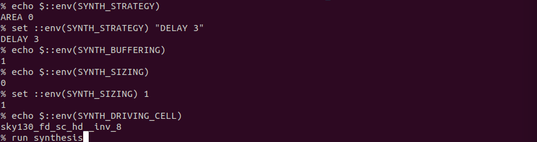

### see that our slack issue has been resolved and our size has increased

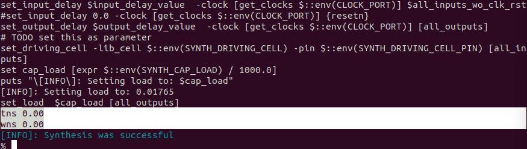
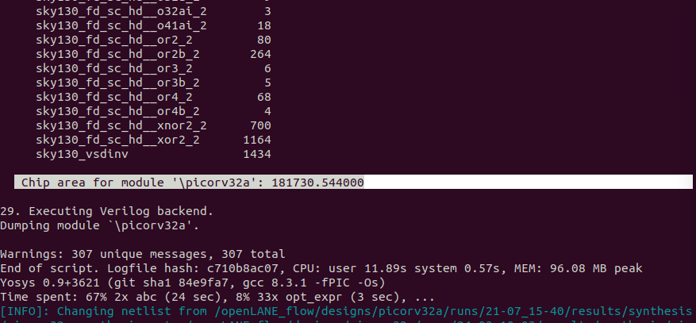