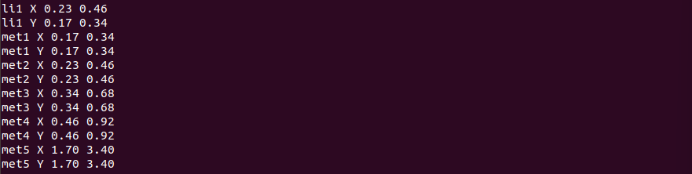

## Converting Grid info to Track info

### Find the tracks.info of sky130_fd_sc_hd and check your track dimensions




### Now inside the inverter file from before you can press G to show the grid and a small black dot should appear in the bottom left of the design


### To align our grid to the correct size to match the track dimensions from earlier type this in the tkcon


### Now the grid is the correct size and the inverter is 3 squares wide, verifying the conditions for the track (We assigned .46 to be the width of a grid cell and the width of the standard cell if you select it is 1.38 or three times that number)


### To practice creating a port with a label, select the A port, open this window and type in the following


### You can also select the Y port and type in these commands to assign the port a class and use


### Now save this to a .lef file


### You can see the port information is in the .lef file


### Now we copy the .lef file to src


### Then inside the libs folder in the vsdstdcelldesigns also copy the lib files

```
# Copy lef file
cp sky130_vsdinv.lef ~/Desktop/work/tools/openlane_working_dir/openlane/designs/picorv32a/src/

# List and check whether it's copied
ls ~/Desktop/work/tools/openlane_working_dir/openlane/designs/picorv32a/src/

# Copy lib files
cp libs/sky130_fd_sc_hd__* ~/Desktop/work/tools/openlane_working_dir/openlane/designs/picorv32a/src/

# List and check whether it's copied
ls ~/Desktop/work/tools/openlane_working_dir/openlane/designs/picorv32a/src/
```


### Next we need to edit config.tcl


### Paste in these lines

```
set ::env(LIB_SYNTH) "$::env(OPENLANE_ROOT)/designs/picorv32a/src/sky130_fd_sc_hd__typical.lib"
set ::env(LIB_FASTEST) "$::env(OPENLANE_ROOT)/designs/picorv32a/src/sky130_fd_sc_hd__fast.lib"
set ::env(LIB_SLOWEST) "$::env(OPENLANE_ROOT)/designs/picorv32a/src/sky130_fd_sc_hd__slow.lib"
set ::env(LIB_TYPICAL) "$::env(OPENLANE_ROOT)/designs/picorv32a/src/sky130_fd_sc_hd__typical.lib"

set ::env(EXTRA_LEFS) [glob $::env(OPENLANE_ROOT)/designs/$::env(DESIGN_NAME)/src/*.lef]
```


## Opening the new inverter in picorv32a

### Now we need to run openlane to see our new inverter in the picorv32a


### paste in a few lines after prepping to run picorv32a with the inverter and then run synthesis

```
# Adiitional commands to include newly added lef to openlane flow
set lefs [glob $::env(DESIGN_DIR)/src/*.lef]
add_lefs -src $lefs
```


### After running the synthesis we see that there is an issue with the slack and take note of these numbers and the size


### Now run these commands to view and edit the synthesis settings

```
# Command to display current value of variable SYNTH_STRATEGY
echo $::env(SYNTH_STRATEGY)

# Command to set new value for SYNTH_STRATEGY
set ::env(SYNTH_STRATEGY) "DELAY 3"

# Command to display current value of variable SYNTH_BUFFERING to check whether it's enabled
echo $::env(SYNTH_BUFFERING)

# Command to display current value of variable SYNTH_SIZING
echo $::env(SYNTH_SIZING)

# Command to set new value for SYNTH_SIZING
set ::env(SYNTH_SIZING) 1

# Command to display current value of variable SYNTH_DRIVING_CELL to check whether it's the proper cell or not
echo $::env(SYNTH_DRIVING_CELL)
```

### Run synthesis again


### see that our slack issue has been resolved and our size has increased


### When we run magic for the placement we can see the new cell in our picorv32a


## Timing Analysis

### We will perform synthesis with the new lef

```
prep -design picorv32a

set lefs [glob $::env(DESIGN_DIR)/src/*.lef]
add_lefs -src $lefs

set ::env(SYNTH_SIZING) 1

run_synthesis
```

### Create a new pre_sta.conf for STA analysis inside our main openlane directory


### also make a base.sdc file in picorv32a/src based on the base.sdc in openlane/scripts


### now from inside the openlane directory we will run sta

```
sta pre_sta.conf
```


### Notice our sta shows lots of slack so we will start to optimize it


### We can locate OR gates driving more fanouts and not enough strength and replace them with ones with higher strength


### these commands replace our weak OR gate and perform analysis

```
# Reports all the connections to a net
report_net -connections _11672_

# Checking command syntax
help replace_cell

# Replacing cell
replace_cell _14513_ sky130_fd_sc_hd__or3_4

# Generating custom timing report
report_checks -fields {net cap slew input_pins} -digits 4
```

### And our slack has been slightly reduced


### Now repeat this, looking for gates that cause an issue until you have significantly reduced slack
### Then replace your old netlist with the new one that has been updated. Make a copy of the synthesis.v file

```
cp picorv32a.synthesis.v picorv32a.synthesis_old.v
```


### Now back inside your STA run this command to write a new verilog file (replace the run name with your own)

```
write_verilog /home/vsduser/Desktop/work/tools/openlane_working_dir/openlane/designs/picorv32a/runs/27-07_00-26/results/synthesis/picorv32a.synthesis.v
```

### Now after running placement we can run the clock timing synthesis (CTS)

```
run_cts
```

