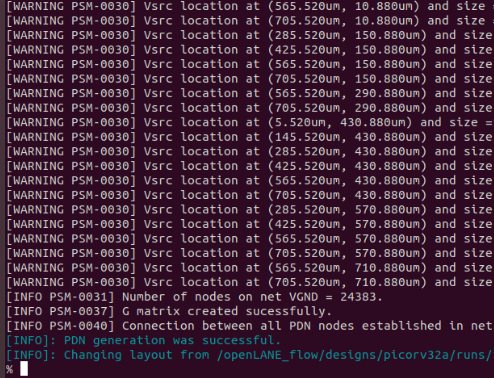
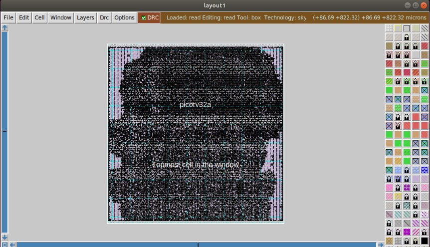
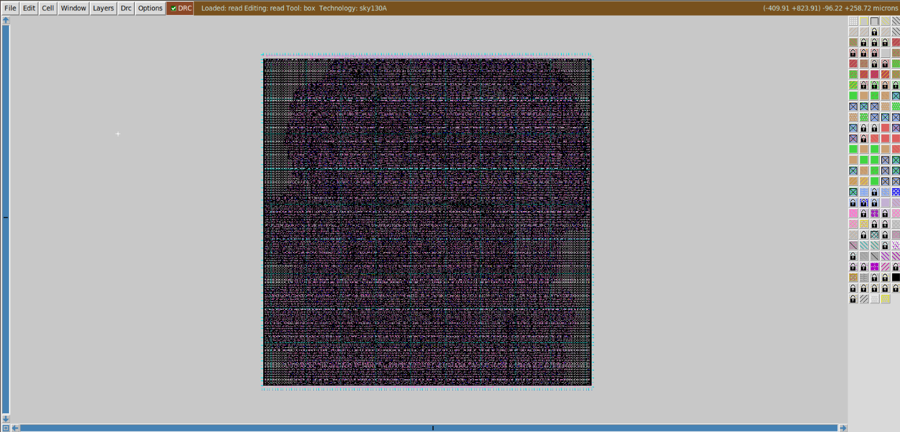
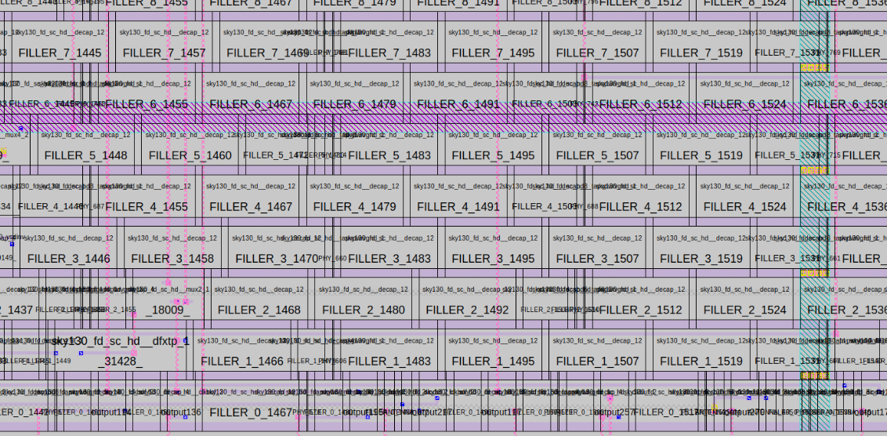
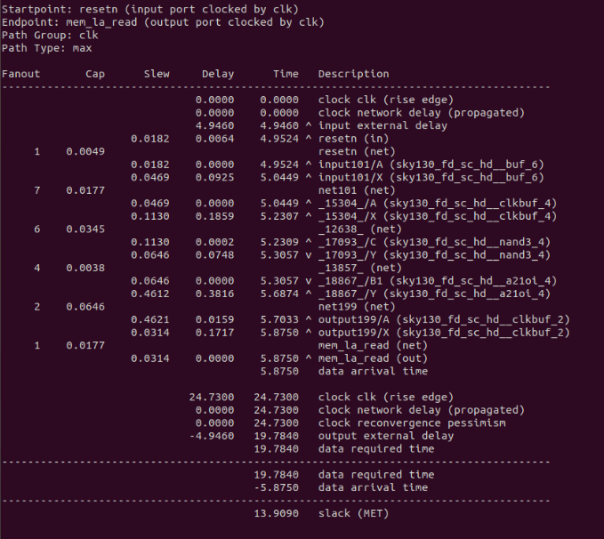

# generate Power Distribution Network and routing with TritonRoute

### Starting from the end of day 4, run the following command after CTS
```
gen_pdn
```



## Now open the pdn def in magic
```
# Change directory to path of PDN def
cd Desktop/work/tools/openlane_working_dir/openlane/designs/picorv32a/runs/24-07_00-26/tmp/floorplan/

# load the PDN def in magic
magic -T /home/vsduser/Desktop/work/tools/openlane_working_dir/pdks/sky130A/libs.tech/magic/sky130A.tech lef read ../../tmp/merged.lef def read 14-pdn.def &
```



## Run detailed routing with TritonRoute and open with magic
```
run_routing
```
```
# Change directory to routed def
cd Desktop/work/tools/openlane_working_dir/openlane/designs/picorv32a/runs/24-07_00-26/results/routing/

# Command to load the routed def in magic
magic -T /home/vsduser/Desktop/work/tools/openlane_working_dir/pdks/sky130A/libs.tech/magic/sky130A.tech lef read ../../tmp/merged.lef def read picorv32a.def &
```





## Now run OpenSTA timing analysis

```
# Command to run OpenROAD tool
openroad

# Reading lef file
read_lef /openLANE_flow/designs/picorv32a/runs/24-07_00-26/tmp/merged.lef

# Reading def file
read_def /openLANE_flow/designs/picorv32a/runs/24-07_00-26/results/routing/picorv32a.def

# Creating an OpenROAD database to work with
write_db pico_route.db

# Loading the created database in OpenROAD
read_db pico_route.db

# Read netlist post CTS
read_verilog /openLANE_flow/designs/picorv32a/runs/24-07_00-26/results/synthesis/picorv32a.synthesis_preroute.v

# Read library for design
read_liberty $::env(LIB_SYNTH_COMPLETE)

# Link design and library
link_design picorv32a

# Read in the custom sdc we created
read_sdc /openLANE_flow/designs/picorv32a/src/my_base.sdc

# Setting all cloks as propagated clocks
set_propagated_clock [all_clocks]

# Read SPEF
read_spef /openLANE_flow/designs/picorv32a/runs/24-07_00-26/results/routing/picorv32a.spef

# Generating custom timing report
report_checks -path_delay min_max -fields {slew trans net cap input_pins} -format full_clock_expanded -digits 4

# Exit to OpenLANE flow
exit
```

